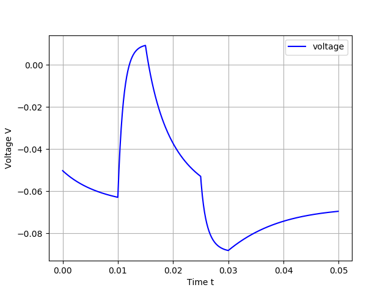
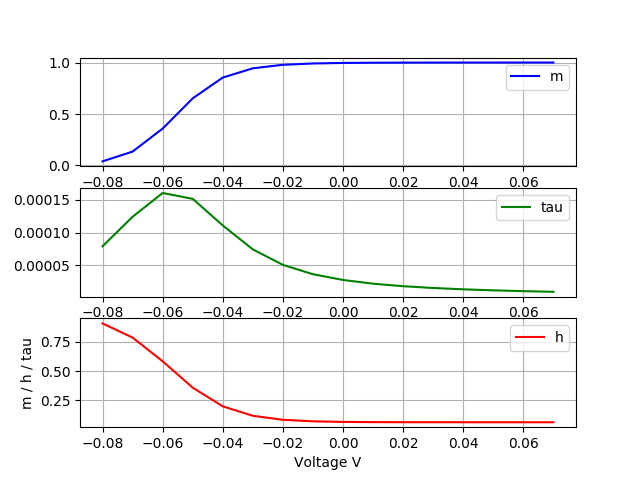
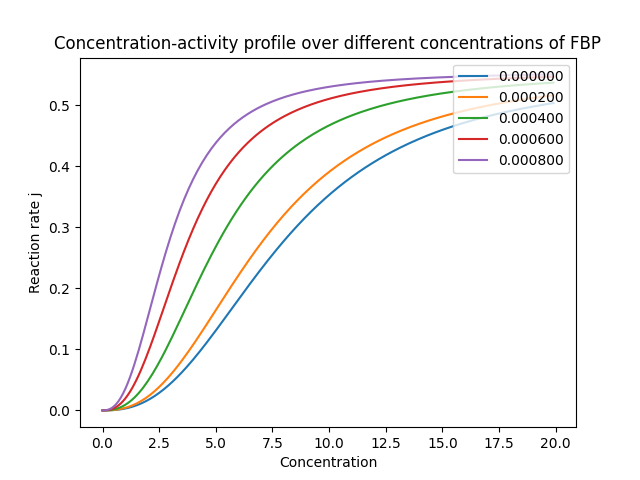
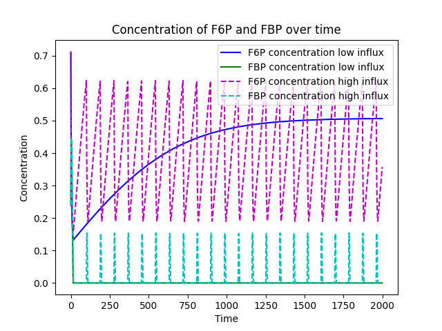
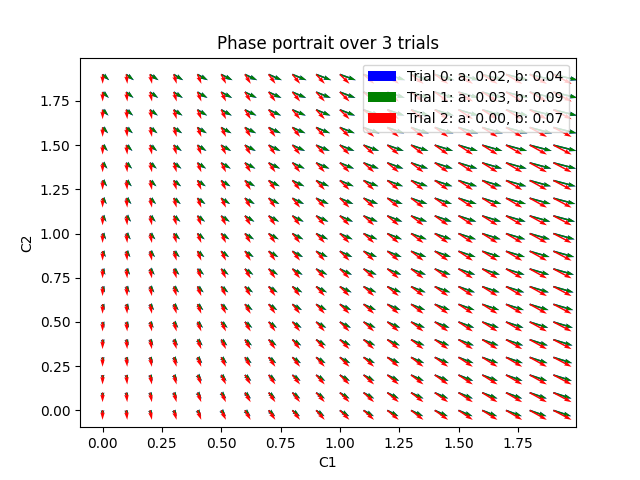

# Mathematical Modelling of Biological Systems (Course Code DD2435)
## Introduction
In an approach to understand biological systems, mathematical scaffolding provides a powerful
tool to investigate complex relationships. KTH provides a course to train students in this field. 
This repository contains all the code that was developed for the assignments and labs. 
The code is documented and a short description is given in the paragraphs below.

## Requirements
The Python scripts require Python 3 (ideally 3.6 or higher). Install the necessary libraries with 
pip via

```bash
python3 -m pip install -r requirements
``` 

## Lab 1
The first lab focused on different implementations of ion channels in neurons; to be precise,
it covers the Goldman-Hodgkin-Katz equation, modelling a spherical membrane compartment, and stochastic
voltage dependent ion channels.

For the Goldman-Hodgkin-Katz equation we assume potassium (K), sodium (Na), and chloride (Cl) channels; 293 Kelvin;
and the following values for permeability, inner-cell concentration, and outer-cell concentration

|   | P (m/s) | C in(mM) | C out(mM) |  
|----|---------|----------|--------|
|K |   4e-9      |   400       |    10       | 
|Na|   0.12e-9      |   50       |   460        | 
|Cl|   0.40e-9      |    40      |     5       | 

The following questions were to be solved:
- Calculate the membrane resting potential 
- Interchange the C in with C out
- What is the resting potential if only the K permeability is non-zero?
- What is the resting potential if only the Na permeability is non-zero?
- What is I when V=–70mV and V=0mV? What is the dimension of I?
- Calculate the I-V relationship of the membrane

To execute the code, run
```bash
python3 lab1/main_ghk.py
```

Now we assume a spherical compartment or a spherical cell. Whilst a reasonable diameter for a cell is 100 microm, a
dendritic spine has a diameter of approx. 1 microm. Implementing the current-voltage differential equation, we
were able to integrate it using the simple Euler forward method and plot the time course of V. In a second 
setup, we change the permeabilities during the simulation time, and display potential as a function of time; the
resulting graph shows a typical spiking behaviour of a neuron.




To execute the code, run
```bash
python3 lab1/main_spherical_membrane.py
```  

As the last part of the assignment, we implemented a the opening and closing behaviour of a voltage dependent
sodium channel and plot their behaviour in different conditions. In particular, we implemented a sodium channel
composing three m-Na particles and one h-Na particle (m3h sodium channel). 



Thereafter, the dynamics of those particles and channels were plotted as a function of time.

To execute the code, run
```bash
python3 lab1/main_channels.py
```

## Lab 2
As enzymes mark an essential part in most biological systems, different models have been developed to investigate 
their behaviour. As part of the second lab, we implemented a part of biochemical pathway:
glycolysis, which is of greatest importance for living cells and converts glucose to pyruvate,
which is then further degraded, yielding ATP, which has a high difference of Gibb's free energy and 
is ubiquitous as a coupled reactant in energy-demanding reactions. The modelled enzyme phosphofructokinase (PFK) 
catalyses the reaction from fructose-6-phosphate (F6P) to fructose-1,6-bisphosphate (FBP), while consuming ATP
and yielding ADP. Using the Michaelis-Menten equation, we're able to plot the concentration-activity profile
for the enzyme.



To execute the code, run
```bash
python3 lab2/main_enzyme.py
```

Now, this enzyme can be modelled as part of a system with a given influx and a catalysed efflux. Plotted over a large
time scale (when you run the scripts yourself you'd need to change the time parameter), the result is an periodically
oscillating system



To execute the code, run
```bash
python3 lab2/main_system.py
```

## Lab 3
The third lab aimed to provide further insight in reaction-diffusion systems. First, we developed a one-dimensional
system, meaning nabla square of the diffusion function was defined for a line. Different starting setups
lead to different behaviour over time. Eventually, plotting the phase portrait gives an indication for how
the system will evolve for different parameters in the system. The following plot shows the
phase portrait for interaction coefficient c1 (interaction with A) and c2 (interaction with B) for species A



To execute the code, run
```bash
python3 lab3/main_1d.py
```

This implementation was extended to a two-dimensional system. The plots are therefore displayed in gif-like manner,
meaning that the plots change over time. 

To execute the code, run
```bash
python3 lab3/main_2d.py
```


